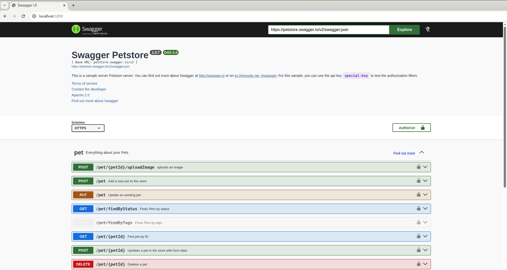
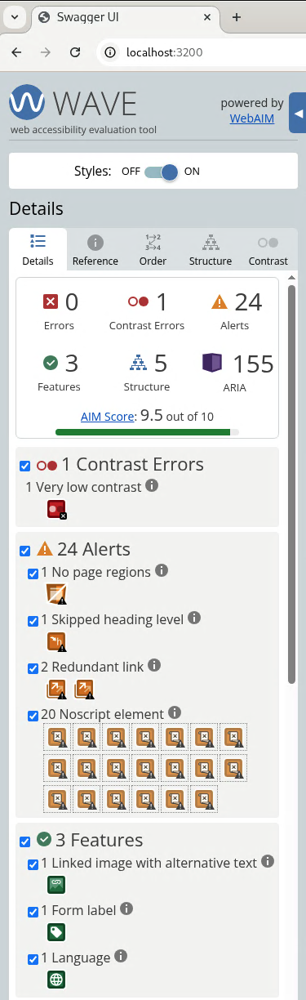

<!--- Provide a general summary of your changes in the Title above -->
## Accessibility Additions to Swagger UI
### Description
<!--- Describe your changes in detail -->
Since at least 2019, there have been requests to make Swagger UI more accessible. When I ran the WAVE Chrome plugin against the Petstore API, Swagger UI had a score of 4.4 out of 10 for accessibility. By adding ARIA labels and increasing contrast on many elements, I was able to increase the WAVE score to 9.5 out of 10. 

### Motivation and Context
<!--- Why is this change required? What problem does it solve? -->
<!--- If it fixes an open issue, please link to the issue here. -->
<!--- Use the magic "Fixes #1234" format, so the issues are -->
<!--- automatically closed when this PR is merged. -->
Having worked in, and as an agent of, the US government for the last 22 years, our websites are required to adhere to Section 508 of the Rehabilitation Act. With API usage increasing amongst multiple Federal agencies and Swagger UI being the de facto standard for documentation, I volunteered to step up and get the application to at least the WCAG 2.2 AA standard. I left the deprecated APIs alone or fix several warnings.

Fixes #7350

### How Has This Been Tested?
<!--- Please describe in detail how you manually tested your changes. -->
<!--- Include details of your testing environment, and the tests you ran to -->
<!--- see how your change affects other areas of the code, etc. -->
Tested on Debian 13 (Trixie) in Chromium 143.0.7499.109 and Firefox 140.6.0esr using Orca screen reader, on Windows 11 (22H2) using Edge and NVDA screen reader, and in Safari on MacOS Tahoe. Ran application in dev mode (`npm run dev`) from the Debian box. Ensured site rendered in all browsers and screen readers were accurate. Checked Developer Tools to see if any errors popped up; there is one, to use 'react-dom/client' when running createRoot. However, that is outside the scope of this PR.

Also ran lint and Jest tests to ensure everything was green across the board. Tested using Node 22.19.4.

### Screenshots (if appropriate):

## Checklist
<!--- Go over all the following points, and put an `x` in all the boxes that apply. -->
<!--- If you're unsure about any of these, don't hesitate to ask. We're here to help! -->

### My PR contains... 
<!--- What types of changes does your code introduce? Put an `x` in all the boxes that apply: -->
- [ ] No code changes (`src/` is unmodified: changes to documentation, CI, metadata, etc.)
- [ ] Dependency changes (any modification to dependencies in `package.json`)
- [ ] Bug fixes (non-breaking change which fixes an issue)
- [x] Improvements (misc. changes to existing features)
- [ ] Features (non-breaking change which adds functionality)

### My changes...
- [ ] are breaking changes to a public API (config options, System API, major UI change, etc).
- [ ] are breaking changes to a private API (Redux, component props, utility functions, etc.).
- [ ] are breaking changes to a developer API (npm script behavior changes, new dev system dependencies, etc).
- [x] are not breaking changes.

### Documentation
- [x] My changes do not require a change to the project documentation.
- [ ] My changes require a change to the project documentation.
- [ ] If yes to above: I have updated the documentation accordingly.

### Automated tests
- [ ] My changes can not or do not need to be tested.
- [x] My changes can and should be tested by unit and/or integration tests.
- [ ] If yes to above: I have added tests to cover my changes.
- [ ] If yes to above: I have taken care to cover edge cases in my tests.
- [x] All new and existing tests passed.
