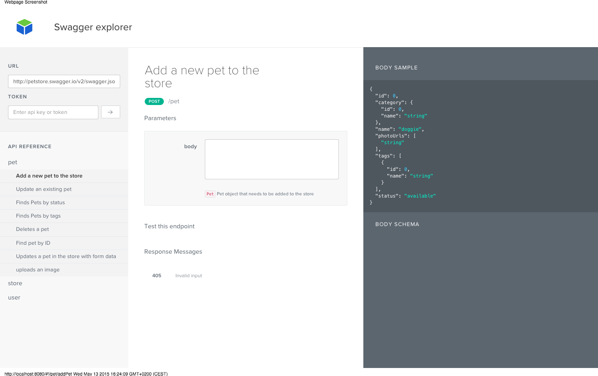
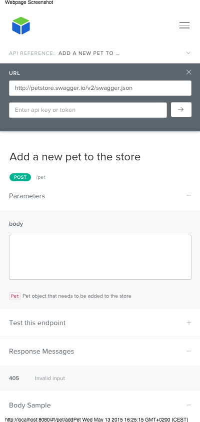

# Swagger UI responsive theme

With inspiration from the [Auth0 api explorer](https://auth0.com/docs/apiv2) the original Swagger UI repo is modified to use a responsive layout.

The theme will adapt to screen size and works on tablets and mobile phones.

Give it a [try](http://senodio.com/site/swagger) and enter your own swagger definition.

## Disclaimer

This is not a fully polished implementation and should be used with care.

## License

Copyright 2011-2015 Reverb technologies, Inc.

Licensed under the Apache License, Version 2.0 (the "License");
you may not use this file except in compliance with the License.
You may obtain a copy of the License at [apache.org/licenses/LICENSE-2.0](http://www.apache.org/licenses/LICENSE-2.0)

Unless required by applicable law or agreed to in writing, software
distributed under the License is distributed on an "AS IS" BASIS,
WITHOUT WARRANTIES OR CONDITIONS OF ANY KIND, either express or implied.
See the License for the specific language governing permissions and
limitations under the License.
